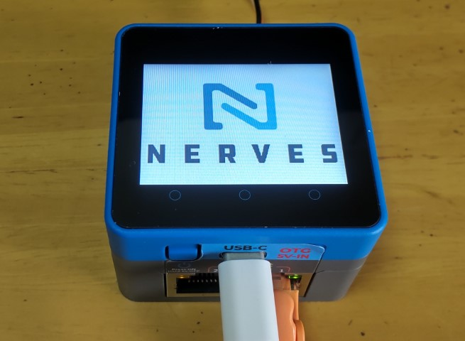

# M5Stack MP135

This is the Nerves System configuration for the
[M5CoreMP135](hhttps://docs.m5stack.com/en/core/M5CoreMP135)



| Feature              | Description                     |
| -------------------- | ------------------------------- |
| CPU                  | STM32MP135DAE7@Arm Cortex-A7@1GHz |
| Memory               | 512 MB DRAM                 |
| Storage              | MicroSD card                    |
| Linux Kernel         | 5.15                             |
| IEx terminal         | HDMI and USB keyboard (can be changed to UART)|
| GPIO, I2C, SPI       | Yes - [Elixir Circuits](https://github.com/elixir-circuits) |
| ADC                  | No                              |
| PWM                  | Yes, but no Elixir support      |
| UART                 | ttySTM0 + more via device tree overlay |
| LCD                  | Yes                             |
| Camera               | None                            |
| Ethernet             | 2x RJ45                         |
| WiFi                 | No                              |
| Bluetooth            | No                              |
| Audio                | TBD                             |

# Project Status

This project is still a work in progress, and any issues will be tracked and resolved through GitHub. While I’m passionate about Nerves, I’m not an expert on Core MP135, so any help with fixes would be greatly appreciated. Contributions through pull requests are very welcome!


# Using

create a project with `mix nerves.new`

add `{:core_mp135, github: "masahiro-999/core_mp135", runtime: false, targets: :core_mp135},` in deps in mix.exs

export `MIX_TARGET=core_mp135`.

run `mix deps.get`

run `mix firmware`

 See the [Getting started
guide](https://hexdocs.pm/nerves/getting-started.html#creating-a-new-nerves-app)
for more information.

## Provisioning devices

This system supports storing provisioning information in a small key-value store
outside of any filesystem. Provisioning is an optional step and reasonable
defaults are provided if this is missing.

Provisioning information can be queried using the Nerves.Runtime KV store's
[`Nerves.Runtime.KV.get/1`](https://hexdocs.pm/nerves_runtime/Nerves.Runtime.KV.html#get/1)
function.

Keys used by this system are:

Key                    | Example Value     | Description
:--------------------- | :---------------- | :----------
`nerves_serial_number` | `"12345678"`      | By default, this string is used to create unique hostnames and Erlang node names.

The normal procedure would be to set these keys once in manufacturing or before
deployment and then leave them alone.

For example, to provision a serial number on a running device, run the following
and reboot:

```elixir
iex> cmd("fw_setenv nerves_serial_number 12345678")
```

This system supports setting the serial number offline. To do this, set the
`NERVES_SERIAL_NUMBER` environment variable when burning the firmware. If you're
programming MicroSD cards using `fwup`, the commandline is:

```sh
sudo NERVES_SERIAL_NUMBER=12345678 fwup path_to_firmware.fw
```

Serial numbers are stored on the MicroSD card so if the MicroSD card is
replaced, the serial number will need to be reprogrammed. The numbers are stored
in a U-boot environment block. This is a special region that is separate from
the application partition so reformatting the application partition will not
lose the serial number or any other data stored in this block.

Additional key value pairs can be provisioned by overriding the default
provisioning.conf file location by setting the environment variable
`NERVES_PROVISIONING=/path/to/provisioning.conf`. The default provisioning.conf
will set the `nerves_serial_number`, if you override the location to this file,
you will be responsible for setting this yourself.

