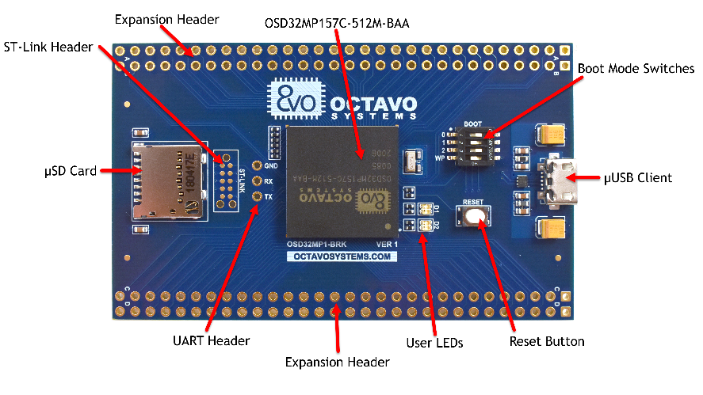

# Generic OSD32MP1 Support

[](https://circleci.com/gh/nerves-project/nerves_system_osd32mp1)
[](https://hex.pm/packages/nerves_system_osd32mp1)

This is the base Nerves System configuration for the
[OSD32MP1-BRK](https://octavosystems.com/octavo_products/osd32mp1-brk/)



| Feature              | Description                     |
| -------------------- | ------------------------------- |
| CPU                  | up to 800 mHz ARM dual Cortex-A7 |
| Memory               | up to 1 GB DRAM                 |
| Storage              | MicroSD card                    |
| Linux Kernel         | 5.4                             |
| IEx terminal         | UART `ttySTM0`                  |
| GPIO, I2C, SPI       | Yes - [Elixir Circuits](https://github.com/elixir-circuits) |
| ADC                  | Yes                             |
| PWM                  | Yes, but no Elixir support      |
| UART                 | ttySTM0 + more via device tree overlay |
| Coprocessor          | embedded M4 STM32               |
| Camera               | None                            |
| Ethernet             | No                              |
| WiFi                 | Requires USB WiFi dongle        |
| Bluetooth            | No                              |
| Audio                | No                              |

# WARNING

This system is still considered in alpha state, expect backwards incompatible changes
to be made

# Using

The most common way of using this Nerves System is create a project with `mix
nerves.new` and to export `MIX_TARGET=osd32mp1`. See the [Getting started
guide](https://hexdocs.pm/nerves/getting-started.html#creating-a-new-nerves-app)
for more information.

If you need custom modifications to this system for your device, clone this
repository and update as described in [Making custom
systems](https://hexdocs.pm/nerves/customizing-systems.html).

## Boot Jumpers

The boot jumpers on the OSD32MP1-BRK board should be set like this to boot from
Micro SDCard. Orient the board so that the USB connector is to the right of the
switch.

|label| | |
|-----|-|-|
|0    | |X|
|1    |X| |
|2    | |X|
|WP   |X| |

# Supported USB WiFi Devices

The base image includes drivers and firmware for Ralink RT53xx (rt2800usb
driver) and RealTek RTL8712U (r8712u driver) devices.

We are still working out which subset of all possible WiFi dongles to support in
our images. At some point, we may have the option to support all dongles and
selectively install modules at packaging time, but until then, these drivers and
their associated firmware blobs add significantly to Nerves release images.

If you are unsure what driver your WiFi dongle requires, run Debian and
configure WiFi for your device. At a shell prompt, run lsmod to see which
drivers are loaded. Running dmesg may also give a clue. When using dmesg,
reinsert the USB dongle to generate new log messages if you don't see them.

## Provisioning devices

This system supports storing provisioning information in a small key-value store
outside of any filesystem. Provisioning is an optional step and reasonable
defaults are provided if this is missing.

Provisioning information can be queried using the Nerves.Runtime KV store's
[`Nerves.Runtime.KV.get/1`](https://hexdocs.pm/nerves_runtime/Nerves.Runtime.KV.html#get/1)
function.

Keys used by this system are:

Key                    | Example Value     | Description
:--------------------- | :---------------- | :----------
`nerves_serial_number` | `"12345678"`      | By default, this string is used to create unique hostnames and Erlang node names.

The normal procedure would be to set these keys once in manufacturing or before
deployment and then leave them alone.

For example, to provision a serial number on a running device, run the following
and reboot:

```elixir
iex> cmd("fw_setenv nerves_serial_number 12345678")
```

This system supports setting the serial number offline. To do this, set the
`NERVES_SERIAL_NUMBER` environment variable when burning the firmware. If you're
programming MicroSD cards using `fwup`, the commandline is:

```sh
sudo NERVES_SERIAL_NUMBER=12345678 fwup path_to_firmware.fw
```

Serial numbers are stored on the MicroSD card so if the MicroSD card is
replaced, the serial number will need to be reprogrammed. The numbers are stored
in a U-boot environment block. This is a special region that is separate from
the application partition so reformatting the application partition will not
lose the serial number or any other data stored in this block.

Additional key value pairs can be provisioned by overriding the default
provisioning.conf file location by setting the environment variable
`NERVES_PROVISIONING=/path/to/provisioning.conf`. The default provisioning.conf
will set the `nerves_serial_number`, if you override the location to this file,
you will be responsible for setting this yourself.

